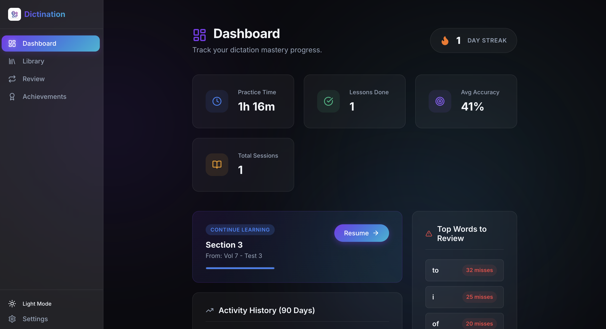
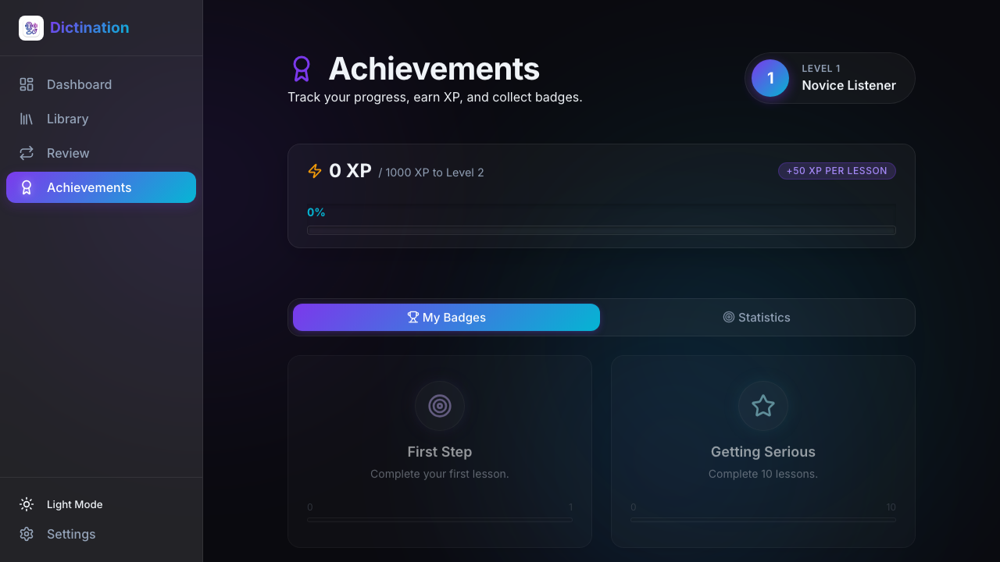
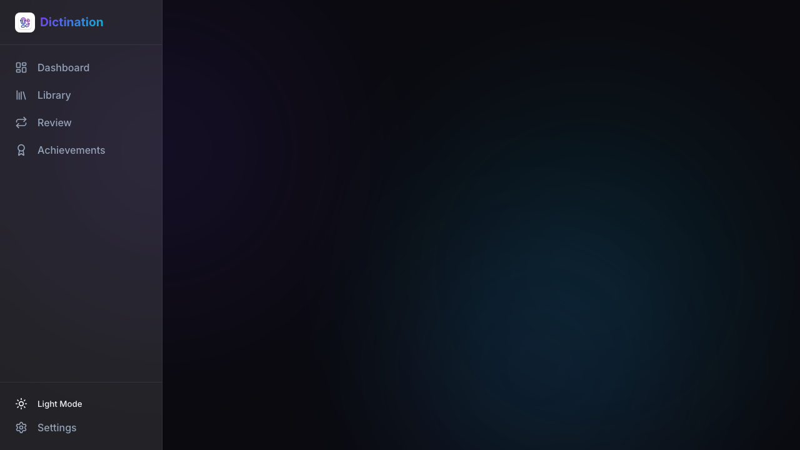
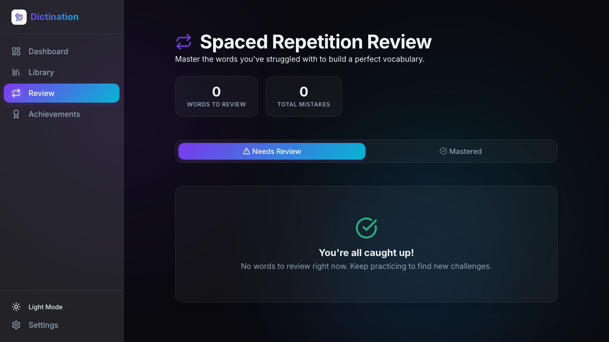
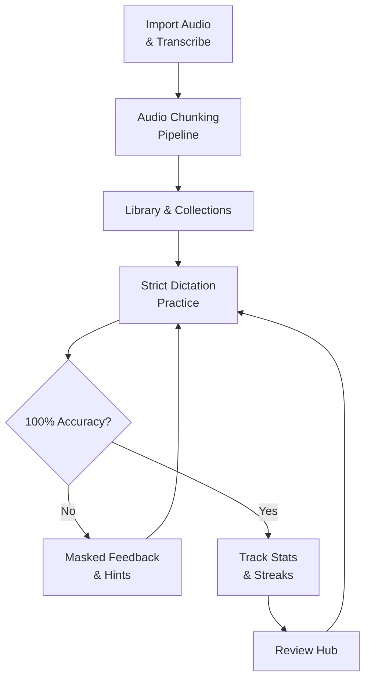

<div align="center">
  
  
  
  
  
</div>

<h1 align="center">Dictination Master</h1>

<div align="center">
  <strong>The Ultimate AI-Powered Dictation & Language Learning Platform.</strong><br>
  <em>Developed by <b>Victor Pham</b></em>
</div>

<br />

<div align="center">
  
  <details>
    <summary>🌙 <b>View Dark Mode</b></summary>
    <br/>
    
  </details>
</div>

<br />

## 🌟 Overview

**Dictination Master** is a premium, strict, and intelligent language learning application built to master your listening and typing skills. Harnessing advanced dictation logic, automated audio chunking, and immersive UI/UX, it forces active listening and exact recall.

Designed with a modern "glassmorphism" aesthetic and intelligent feedback systems, it serves as the definitive tool for users looking to train their ear and typing accuracy to absolute perfection.

---

## ✨ Features Showcase

### 📊 Comprehensive Dashboard & Achievements
Monitor your mastery journey. View your learning heatmaps, track daily streaks, and analyze your most difficult words in a sleek, theme-aware layout.

<div align="center">
  
</div>

### 🎧 Intelligent Audio Transcription
Upload large audio files (25+ minutes) seamlessly. The built-in audio chunking pipeline automatically segments, processes via AI, and merges the transcripts with synchronized timestamps—entirely in the background.

<div align="center">
  
</div>

### ⌨️ Strict Dictation Mastery Logic
Achieve true mastery. The strict evaluation mode demands 100% accuracy to progress. It uses masked feedback to highlight errors without revealing the correct answers immediately, forcing genuine learning.

<div align="center">
  
</div>

### 🗣️ Audio Pronunciation System
Integrated Text-to-Speech (TTS) provides precise pronunciation for target words. Choose effortlessly between British and American English accents for targeted auditory training.

### 🧠 Smart Review & Hint System
Get surgical help when you're stuck. The interactive hint mechanism guides you to the correct answer rather than just giving it away, ensuring long-term retention. 

<div align="center">
  
</div>

---

## 🛠️ Tech Stack

| Category | Technology |
|---|---|
| **Frontend Framework** | React 19 + TypeScript |
| **Build Tool** | Vite |
| **Styling** | Vanilla CSS + Theme Variables (Glassmorphism UI) |
| **State Management** | React Hooks + Dexie (IndexedDB) |
| **Routing** | React Router v7 |
| **Icons** | Lucide React |

---

## 🚀 Getting Started

### Prerequisites

Make sure you have Node.js installed. We recommend using **Node 18+**. (Using `bun` is highly recommended for speed).

### Installation

1. **Clone the repository**:
   ```bash
   git clone git@github.com-personal:ducthinh17/Dictination.git
   cd Dictination
   ```

2. **Install dependencies**:
   ```bash
   npm install
   # Or using bun: bun install
   ```

3. **Set up Environment Variables**:
   Create a `.env.local` file at the root of the project to enable the AI transcription engine:
   ```bash
   VITE_GEMINI_API_KEY=your_gemini_api_key_here
   ```

4. **Run the Development Server**:
   ```bash
   npm run dev
   # Or using bun: bun run dev
   ```

5. **Open your browser** and visit `http://localhost:5173` to see the application in action.

---

## 🎓 How It Works (Learning Flow)



---

## 📝 License

This project is licensed under the **MIT License**. See the [LICENSE](LICENSE) file for details.

---

<div align="center">
  Made with ❤️ by <b>Victor Pham</b>
</div>
